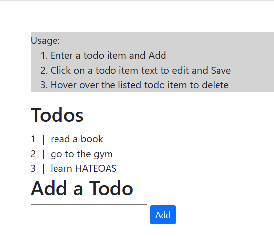

# spring-mvc-todo-thymeleaf-htmx
Spring MVC TODO example using thymeleaf and htmx. Use of htmx enables running the TODO app like an SPA.

## Usage

Run the Spring MVC app 
.\gradlew bootRun

Accessing http://localhost:8080/todos should display a screen like:

## Integration Tests

Integration tests for the APIs can be run using:

.\gradlew test --tests "TodoControllerTest"

## e2e Tests

e2e tests are setup using Playwright gradle dependency. e2e tests can be run using:

.\gradlew test --tests "TodosPlaywrightTest"